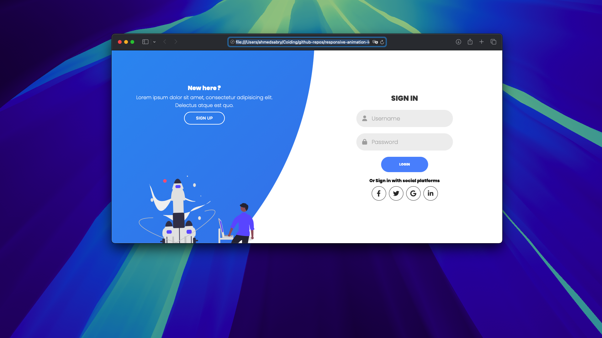

# Responsive Animation Login/Signup Form



## 🚀 Live Demo
Experience a modern, animated login/signup form with smooth transitions and a beautiful UI.

---

## ✨ Features
- Responsive design for all devices
- Stunning animated transitions between login and signup
- Social media login buttons
- Modern, clean look with SVG illustrations
- Built with HTML, CSS (Poppins font, FontAwesome icons), and JavaScript

---

## 📸 Screenshots

| Login Screen | Signup Screen |
|--------------|--------------|

| Desktop preview  | Mobile Preview  |

---

## 🛠️ Usage
1. Clone this repo:
   ```bash
   git clone https://github.com/yourusername/responsive-animation-login-signup.git
   ```
2. Open `index.html` in your browser.

---

## 📂 Project Structure
```
index.html
css/
  style.css
js/
  app.js
images/
  undraw_maker_launch_re_rq81.svg
  undraw_press_play_re_85bj.svg
docs/
  screenshort-1.mov
  screenshort-2.mov
```

---

## 💡 Customization
- Replace SVGs in `images/` for your own branding.
- Update colors and fonts in `css/style.css`.

---

## 🤝 Contributing
Pull requests are welcome! For major changes, please open an issue first.

---

## 📄 License
This project is open source and available under the [MIT License](LICENSE).

---

> **Made with ❤️ by [Your Name]**
